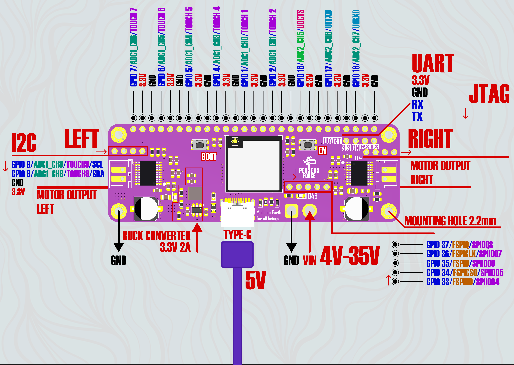

# PerseusS3

**PerseusS3** is a compact ESP32-S3-based robotics development board designed for mobile robots, educational robotics, and robotics competitions.

It combines an ESP32-S3 controller, two high-current brushed DC motor drivers, a 12-channel line-sensor interface, power regulation, wireless connectivity, and USB programming on a single board.

The accompanying Arduino library provides a simple API for controlling the board hardware.

---

## Hardware Overview

| Specification | PerseusS3 |
|---|---|
| MCU | ESP32-S3-MINI-1U-N8 |
| CPU | Dual-core Xtensa LX7, up to 240 MHz |
| Flash | 8 MB |
| Wireless | 2.4 GHz Wi-Fi + Bluetooth Low Energy |
| Logic voltage | 3.3 V |
| Board input voltage | 4–35 V |
| On-board regulator | 3.3 V, up to 2 A |
| Motor channels | 2 brushed DC motors |
| Motor driver | MP6612D |
| Continuous driver current | Up to 5 A per motor driver |
| OCP threshold | 14.5 A |
| USB | USB Type-C |
| Board dimensions | approximately 80 × 27 × 9.9 mm |
| Framework | Arduino / ESP32 |

> **Warning:** PerseusS3 uses 3.3 V logic. Do not apply more than 3.3 V directly to ESP32-S3 GPIO pins.

---

## ESP32-S3 Controller

PerseusS3 is based on the **ESP32-S3-MINI-1U-N8** module.

The ESP32-S3 provides a dual-core processor running at up to **240 MHz**, together with integrated Wi-Fi and Bluetooth Low Energy connectivity.

The MCU provides the processing capability required for real-time robotics applications while supporting common embedded interfaces such as:

UART, SPI, I²C, PWM, ADC, timers, USB, and general-purpose GPIO.

The PerseusS3 library handles board-specific hardware such as the motor drivers and line-sensor multiplexer while other ESP32-S3 peripherals can still be accessed through the standard Arduino ESP32 API.

---

# Motor System

PerseusS3 includes **two independent brushed DC motor channels**.

Each motor is controlled by an **MP6612D full H-bridge motor driver**.

The motor channels are identified as:

```text
Left Motor
Right Motor
```

### Motor GPIO Assignments

| Signal | Left Motor | Right Motor |
|---|---:|---:|
| EN / PWM | GPIO 11 | GPIO 15 |
| DIR | GPIO 10 | GPIO 14 |
| SLP | GPIO 12 | GPIO 13 |

---

## MP6612D Motor Driver

The **MP6612D** is a high-current H-bridge driver designed for reversible brushed DC motors.

The IC supports up to **5 A of continuous driver current** under suitable electrical and thermal conditions.

PerseusS3 itself is designed for a board input voltage of **4–35 V**.

### Motor Driver Electrical Characteristics

| Parameter | Value |
|---|---:|
| Driver | MP6612D |
| PerseusS3 board input | 4–35 V |
| Continuous driver current | Up to 5 A |
| High-side MOSFET RDS(ON) | 70 mΩ typical |
| Low-side MOSFET RDS(ON) | 45 mΩ typical |
| Typical active-path resistance | ~115 mΩ |
| External PWM capability | Up to 100 kHz |
| PerseusS3 PWM frequency | 20 kHz |
| OCP threshold | 14.5 A |
| OCP retry time | approximately 4 ms |

### Continuous Current

The MP6612D is rated for up to **5 A continuous output current**.

Actual continuous current capability depends on operating conditions including PCB thermal design, airflow, ambient temperature, motor duty cycle, and supply voltage.

The **5 A specification is the continuous driver-current rating and should not be confused with the over-current protection threshold**.

### Over-Current Protection

The MP6612D contains internal short-circuit and over-current protection.
The **14.5 A value is a protection threshold, not a continuous or recommended operating current**.

### Integrated Protection

The MP6612D provides hardware protection against over-current, over-temperature, under-voltage, and over-voltage conditions.

It also includes internal current sensing and cycle-by-cycle current regulation without requiring an external low-resistance current-shunt resistor.

---

## Motor PWM

The PerseusS3 library configures both motor channels for:

```text
PWM frequency: 20 kHz
PWM resolution: 8 bit
Command range: -255 ... +255
```

Motor commands are signed.

```text
+255    Maximum power in one direction
   0    Electrical brake
-255    Maximum power in the opposite direction
```

Values outside the supported range are automatically clamped to `-255...255`.

---

## Safe Direction Changes

The library removes motor PWM before changing the `DIR` signal.

This prevents a direction transition from occurring while a previous PWM pulse may still be active.

The sequence is approximately:

```text
PWM -> 0
Wait for PWM settling
Change DIR
Apply new PWM
```

This delay is intended for electrical signal settling.

It does **not** guarantee that a moving motor has mechanically stopped before reversing direction.

---

# Arduino Library

The PerseusS3 Arduino library provides an API for:

Motor control, motor direction inversion, 12-channel line-sensor reading, configurable ADC resolution, and custom line-sensor GPIO assignments.

---

## Installation

### Arduino IDE

1. Install **ESP32 by Espressif Systems** from Arduino Boards Manager.
2. Download this repository as a ZIP.
3. Open Arduino IDE.
4. Go to **Sketch > Include Library > Add .ZIP Library**.
5. Select the downloaded ZIP file.

Then include the library:

```cpp
#include <PerseusS3.h>
```

### PlatformIO

Add the repository to `platformio.ini`:

```ini
lib_deps =
    https://github.com/lanjuni-davit/PerseusS3.git
```

Then include:

```cpp
#include <PerseusS3.h>
```

---

# Motor Control

Initialize both motor drivers:

```cpp
#include <Arduino.h>
#include <PerseusS3.h>

void setup() {
    PerseusS3.beginLeft();
    PerseusS3.beginRight();
}

void loop() {
}
```

Run both motors:

```cpp
PerseusS3.runLeft(150);
PerseusS3.runRight(150);
```

Reverse both motors:

```cpp
PerseusS3.runLeft(-150);
PerseusS3.runRight(-150);
```

Brake:

```cpp
PerseusS3.runLeft(0);
PerseusS3.runRight(0);
```

`0` applies electrical braking. It does not disable the motor driver or place the output into a coast state.

---

## Motor Example

```cpp
#include <Arduino.h>
#include <PerseusS3.h>

void setup() {
    PerseusS3.beginLeft();
    PerseusS3.beginRight();
}

void loop() {

    // Forward
    PerseusS3.runLeft(150);
    PerseusS3.runRight(150);
    delay(2000);

    // Brake
    PerseusS3.runLeft(0);
    PerseusS3.runRight(0);
    delay(1000);

    // Reverse
    PerseusS3.runLeft(-150);
    PerseusS3.runRight(-150);
    delay(2000);

    // Brake
    PerseusS3.runLeft(0);
    PerseusS3.runRight(0);
    delay(1000);
}
```

---

# Motor Direction Inversion

Motors mounted on opposite sides of a robot are commonly mirrored mechanically.

PerseusS3 allows each motor's logical direction to be changed in software.

```cpp
PerseusS3.setLeftInverted(true);
PerseusS3.setRightInverted(true);
```

Disable inversion:

```cpp
PerseusS3.setLeftInverted(false);
PerseusS3.setRightInverted(false);
```

The current library configuration has the **left motor inverted by default**.

For compatibility with older sketches:

```cpp
PerseusS3.reverseLeft();
PerseusS3.reverseRight();
```

These functions enable inversion.

They do not toggle the direction back when called a second time.

---

# Line Sensor System

PerseusS3 supports up to **12 analog line sensors** through a multiplexer-based sensor interface.

Instead of requiring twelve separate ADC pins, the multiplexer connects one selected sensor at a time to the ESP32-S3 ADC input.

### Default Line Sensor GPIO

| Signal | GPIO |
|---|---:|
| S0 | 36 |
| S1 | 35 |
| S2 | 34 |
| S3 | 33 |
| ADC input | 7 |

The selector pins determine which sensor channel is connected to the ADC input.

Valid line-sensor indexes are:

```text
0 ... 11
```

---

## Initialize Line Sensors

Use the default PerseusS3 configuration:

```cpp
PerseusS3.beginLineSensors();
```

Custom pins can also be provided:

```cpp
PerseusS3.beginLineSensors(
    37,
    36,
    35,
    34,
    4
);
```

The arguments are:

```text
S0
S1
S2
S3
ADC input
```

---

## Read a Line Sensor

Read sensor 0:

```cpp
int16_t value = PerseusS3.readLineSensor(0);
```

Read sensor 5:

```cpp
int16_t value = PerseusS3.readLineSensor(5);
```

Valid indexes are:

```text
0 ... 11
```

An invalid index returns:

```text
-1
```

After changing the multiplexer channel, the library waits approximately:

```text
10 µs
```

before performing the ADC measurement to allow the multiplexer output and ADC input to settle.

---

# ADC Resolution

Configure the ADC reading resolution:

```cpp
PerseusS3.setAdcResolution(12);
```

The library accepts values from:

```text
1 ... 15 bits
```

| Resolution | Nominal Digital Range |
|---:|---:|
| 8 bit | 0–255 |
| 10 bit | 0–1023 |
| 12 bit | 0–4095 |
| 15 bit | 0–32767 |

Changing ADC resolution changes the digital representation of the analog measurement.

It does not change the optical sensitivity of the physical line sensor.

---

## Line Sensor Example

```cpp
#include <Arduino.h>
#include <PerseusS3.h>

void setup() {

    Serial.begin(115200);

    PerseusS3.beginLineSensors();
    PerseusS3.setAdcResolution(12);
}

void loop() {

    for (uint8_t i = 0; i < 12; i++) {

        int16_t value = PerseusS3.readLineSensor(i);

        Serial.print("S");
        Serial.print(i);
        Serial.print(": ");
        Serial.print(value);
        Serial.print("  ");
    }

    Serial.println();

    delay(100);
}
```

---

# API Reference

| Method | Description |
|---|---|
| `beginLeft()` | Initialize the left motor driver |
| `beginRight()` | Initialize the right motor driver |
| `runLeft(int16_t pwm)` | Control the left motor with signed PWM |
| `runRight(int16_t pwm)` | Control the right motor with signed PWM |
| `setLeftInverted(bool)` | Enable or disable left motor inversion |
| `setRightInverted(bool)` | Enable or disable right motor inversion |
| `beginLineSensors(...)` | Initialize the line-sensor multiplexer |
| `setAdcResolution(uint8_t bits)` | Configure ADC reading resolution |
| `readLineSensor(uint8_t index)` | Read one line-sensor channel |
| `reverseLeft()` | Compatibility method for enabling left inversion |
| `reverseRight()` | Compatibility method for enabling right inversion |
| `linebegin(...)` | Compatibility alias for `beginLineSensors(...)` |
| `linegetState(index)` | Compatibility alias for `readLineSensor(index)` |

---

# Important Electrical Notes

The PerseusS3 GPIO logic level is **3.3 V**.

Do not connect a signal greater than 3.3 V directly to an ESP32-S3 GPIO pin.

The board maximum input voltage and the maximum voltage rating of an individual IC are not the same specification. Although the MP6612D motor driver itself supports operation up to 40 V, the specified PerseusS3 board supply range is **4–35 V**.

The **5 A motor-driver rating** is a continuous-current specification under suitable thermal conditions.

The **14.5 A OCP value** is the minimum hardware over-current protection threshold with `OC_ADJ = GND`. It is not a recommended operating current and must not be treated as the motor driver's continuous-current capability.

High-current motor operation produces significant heat. Available continuous current depends on PCB temperature, ambient temperature, airflow, supply voltage, duty cycle, and motor load.

---

# Examples

Example sketches are included in:

```text
examples/
├── BasicMotorControl/
│   └── BasicMotorControl.ino
└── BasicLineSensor/
    └── BasicLineSensor.ino
```

---

# Compatibility

| Parameter | Support |
|---|---|
| Board | PerseusS3 |
| MCU | ESP32-S3 |
| Framework | Arduino |
| Architecture | ESP32 |
| Arduino IDE | Supported |
| PlatformIO | Supported |

---

# Repository Structure

```text
PerseusS3/
├── src/
│   ├── PerseusS3.cpp
│   └── PerseusS3.h
│
├── examples/
│   ├── MotorControl/
│   └── LineSensor/
│
├── Images/
│   └── PerseusForge.png
│
├── library.properties
├── README.md
└── LICENSE.md
```

---

# License

Copyright 2026 Davit Lanjuni.

Licensed under the [Apache License 2.0](LICENSE.md).